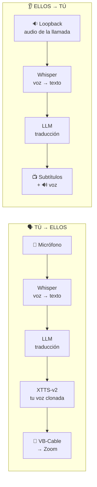

<div align="center">

# 🎙️ EchoLingua

### Traductor de llamadas en tiempo real · 100 % local · con clonación de tu voz

Habla en tu idioma y que la otra persona te escuche **en el suyo, con tu propia voz clonada**.
Traduce en vivo las dos direcciones de una llamada (Zoom · Meet · Discord · Teams), sin enviar
nada a la nube: todo corre en tu GPU.


</div>

---

## ✨ Qué hace

- 🗣️ **Traducción bidireccional en vivo** — lo que dices y lo que escuchas, en tiempo casi real.
- 🎭 **Clonación de tu voz** — la otra persona te oye en otro idioma *con tu propia voz* (XTTS‑v2).
- 🌍 **17 idiomas** seleccionables (es, en, pt, fr, de, it, ru, zh, ja, ko, ar, hi…).
- 🔒 **100 % local y privado** — sin APIs de pago, sin nube, sin fugas de datos.
- 🖥️ **Interfaz gráfica** con selección de idiomas/dispositivos e historial de conversación.
- 🔌 **Backend LLM intercambiable** — Ollama en tu laptop, **vLLM** en un servidor GPU, sin tocar código.

## 🎬 Demo

> _(Espacio para tu GIF/video de demostración — ver `docs/DEMO.md`.)_

---

## 🏗️ Arquitectura

Dos *pipelines* independientes corriendo en paralelo, cada uno en su hilo:



**Decisión de diseño clave:** el LLM se consume vía **API compatible con OpenAI**, así que el
mismo código sirve para [Ollama](https://ollama.com) (desarrollo local) y
[vLLM](https://github.com/vllm-project/vllm) (producción en servidor GPU) — solo cambia una URL.

### 🧱 Stack

| Componente | Tecnología | Rol |
|---|---|---|
| **STT** | [faster-whisper](https://github.com/SYSTRAN/faster-whisper) (CTranslate2) | Voz → texto en GPU |
| **Traducción** | [Ollama](https://ollama.com) / [vLLM](https://github.com/vllm-project/vllm) (OpenAI API) | Texto → texto |
| **TTS + clonación** | [XTTS‑v2](https://github.com/idiap/coqui-ai-TTS) (Coqui) | Texto → tu voz, con *streaming* |
| **VAD** | webrtcvad | Detecta fin de frase |
| **Audio** | soundcard (WASAPI loopback) + VB‑Audio Cable | Captura y enrutado |
| **GUI** | customtkinter | Panel de control |

---

## ⚡ Optimización de latencia (4 s → 1.4 s)

El reto real de este proyecto no fue la IA, sino la **latencia**. Perfilando cada etapa:

| Etapa | Antes | Después | Cómo |
|---|---:|---:|---|
| Síntesis de voz (XTTS) | 2.31 s | **0.37 s** | *streaming*: reproduce mientras genera (`inference_stream`) + caché de latentes |
| Espera de fin de frase | 0.70 s | **0.35 s** | VAD más ágil |
| Traducción (LLM) | 0.51 s | **0.36 s** | modelo pequeño + conexión persistente |
| Voz → texto (Whisper) | 0.51 s | **0.18 s** | `int8_float16` en GPU |
| **Total percibido** | **~4 s** | **~1.4 s** | |

> El *streaming* de voz fue la clave: en vez de esperar a generar todo el audio, la otra
> persona empieza a oírte en ~0.4 s. El resto es un piso inevitable (el sistema espera a que
> termines la frase para traducir — funciona por turnos, como un intérprete humano).

---

## 🚀 Instalación

> Requisitos: Windows · Python 3.11 · GPU NVIDIA (≥6 GB) · [Ollama](https://ollama.com) · [VB‑Audio Cable](https://vb-audio.com/Cable/)

```powershell
git clone https://github.com/<tu-usuario>/echolingua.git
cd echolingua

python -m venv .venv
.\.venv\Scripts\Activate.ps1

# 1) PyTorch + torchaudio con CUDA
pip install torch==2.5.1 torchaudio==2.5.1 --index-url https://download.pytorch.org/whl/cu121
# 2) El resto
pip install -r requirements.txt
# 3) Modelo de traducción
ollama pull qwen2.5:3b
```

Instala **VB‑Audio Cable** (crea el micrófono virtual hacia la app de llamadas) y reinicia.

### Verificar el entorno
```powershell
python test_entorno.py      # debe dar 5/5
```

### Grabar tu voz (para clonarla)
```powershell
python grabar_voz.py        # habla ~15 s con naturalidad
```

## 🎧 Uso

```powershell
python app.py               # interfaz gráfica (recomendada)
python main.py --tu es --ellos en   # o por terminal
```

En Zoom/Meet/Discord: **Micrófono → `CABLE Output`** · Altavoz → tu parlante normal.

---

## 🖧 Despliegue con vLLM (servidor GPU)

Para servir el LLM con vLLM (alto rendimiento) en un servidor Linux con GPU:

```bash
# En el servidor
pip install vllm
vllm serve Qwen/Qwen2.5-3B-Instruct --port 8000 --api-key mi-clave
```

Y en `config.py` solo cambias el backend — **ninguna otra línea de código**:

```python
LLM_BASE_URL = "http://IP_DEL_SERVIDOR:8000/v1"
LLM_MODELO   = "Qwen/Qwen2.5-3B-Instruct"
LLM_API_KEY  = "mi-clave"
```

## 🗂️ Estructura

```
echolingua/
├─ app.py              # interfaz gráfica (entrada principal)
├─ main.py             # CLI
├─ config.py           # idiomas, modelos, backend LLM, latencia
├─ grabar_voz.py       # graba tu muestra de voz
├─ test_entorno.py     # valida el entorno (5 checks)
└─ src/
   ├─ motor.py         # núcleo: modelos + 2 flujos (iniciar/detener)
   ├─ gui.py           # ventana customtkinter
   ├─ traductor.py     # cliente LLM (OpenAI-compatible: Ollama/vLLM)
   ├─ voz.py           # XTTS‑v2 con streaming + caché de voz
   ├─ stt.py           # faster-whisper
   ├─ audio.py         # captura + VAD (segmentación por voz)
   └─ dispositivos.py  # selección robusta de mic/parlantes
```

## ⚠️ Limitaciones (honestas)

- Funciona **por turnos**, no es simultáneo perfecto: ~1.4 s de latencia por frase.
- Acentos muy marcados, ruido o varias voces a la vez bajan la precisión.
- La dirección "entrante" requiere una **llamada real** (la voz del otro debe salir por tus parlantes).
- Pensado para Windows + GPU NVIDIA; en otras plataformas hay que ajustar la captura de audio.

## 🗺️ Roadmap

- [ ] Empaquetar como ejecutable (PyInstaller) para no depender de la terminal.
- [ ] Historial exportable de la conversación.
- [ ] Modo "solo subtítulos" ultraligero para equipos sin GPU potente.
- [ ] Soporte multiplataforma (Linux/macOS) para la captura de audio.

## 📄 Licencia

MIT © 2026 David Burgos — ver [LICENSE](LICENSE).

<div align="center">
<sub>Construido con Whisper · XTTS‑v2 · Ollama/vLLM · 100 % local 🔒</sub>
</div>
